# Z-works
## Tác giả
- **Họ và tên:** Trần Thị Thúy Vy
- **Mã số sinh viên:** 21046361
## Tổng quan 
Z-works là 1 website tuyển dụng nhân sự, cho phép các công ty đăng thông tin tuyển dụng và người dùng có thể tìm kiếm công việc phù hợp với mình.
## Công nghệ sử dụng
- **Java**: Ngôn ngữ lập trình chính.
- **Spring Boot**: Framework phát triển ứng dụng Java.
- **Gradle**: Công cụ quản lý build.
- **Thymeleaf**: Template engine cho HTML động.
- **Bootstrap**: Framework giao diện front-end.
- **MariaDB**: Hệ quản trị cơ sở dữ liệu.
- **JPA**: API quản lý dữ liệu với cơ sở dữ liệu.
- **Mail (Spring Mail)**: Gửi email thông báo.
- **Spring Security**: Bảo mật và xác thực người dùng.

## Chức năng
#### **Ứng viên:**
- Đăng ký/Đăng nhập
- Xem các bài tuyển dụng
- Gợi ý công việc phù hợp với kỹ năng
- Cập nhật hồ sơ cá nhân
- Ứng tuyển công việc
- Gợi ý các kỹ năng cần học

#### **Công ty:**
- Đăng ký/Đăng nhập
- Đăng thông tin tuyển dụng
- Tìm kiếm ứng viên có kỹ năng phù hợp
- Gửi email mời ứng viên
- Xem thông tin ứng viên đã ứng tuyển


## Yêu cầu
- Java 8 trở lên.
- Gradle 6.8.3 trở lên.
- MariaDB 10.5 trở lên.
- IDE hỗ trợ Java: Eclipse, IntelliJ IDEA, NetBeans.
- Trình duyệt web: Chrome, Firefox, Safari, Edge...

### Cài đặt dự án
1. Clone repository về máy tính của bạn:
   ```bash
   git clone https://github.com/tranvy57/TranThiThuyVy_21046361_week05.git
    ```
2. Mở project bằng IDE.
3. Mở file `application.properties` trong thư mục `src/main/resources` và cấu hình cơ sở dữ liệu:
   ```properties
   spring.application.name=Zy_week05
    spring.datasource.url=jdbc:mariadb://localhost:3308/works?createDatabaseIfNotExist=true
    spring.datasource.username=root
    spring.datasource.password=sapassword
    spring.datasource.driver-class-name=org.mariadb.jdbc.Driver
    
    spring.jpa.hibernate.ddl-auto=update
    spring.jpa.show-sql=true
    
    spring.mail.host=smtp.gmail.com
    spring.mail.port=587
    spring.mail.username=<your-email>
    spring.mail.password=<your-app-password>
    spring.mail.properties.mail.smtp.auth=true
    spring.mail.properties..mail.smtp.starttls.enable=true
   ```
4. Chạy project và truy cập vào địa chỉ `http://localhost:8080` để sử dụng.

## Cấu trúc thư mục
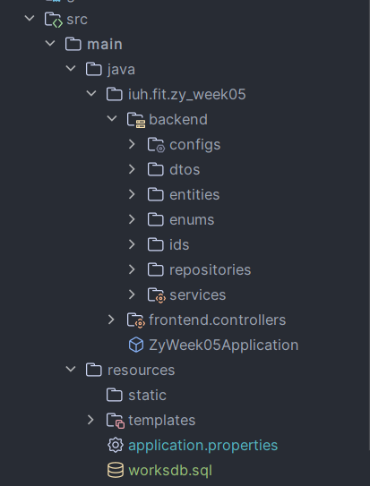
- src/main/java: Chứa mã nguồn Java.
- src/main/resources: Chứa các tệp cấu hình như application.properties.
- src/main/resources/templates: Chứa các tệp Thymeleaf templates.
- src/main/resources/worksdb.sql: Chứa dữ liệu mẫu.

## Demo
### Trang chủ
Người dùng chưa đăng nhập có thể vào trang chủ để xem thông tin công việc.
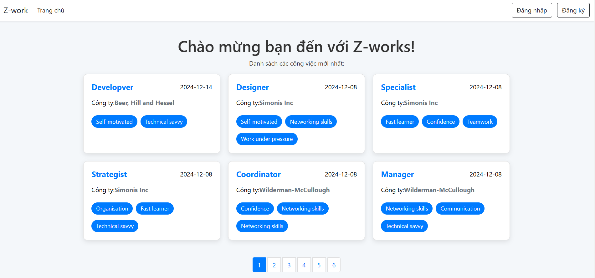
Click vào công việc để xem chi tiết công việc:
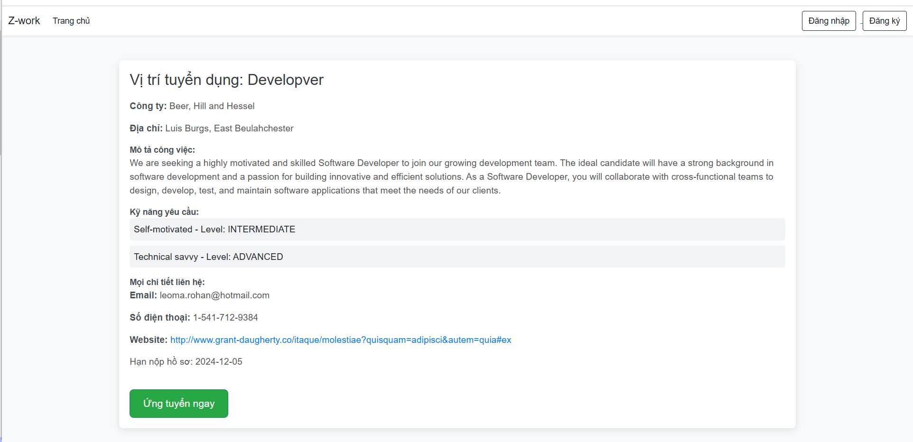
### Đăng ký
Người dùng có thể đăng ký tài khoản công ty hoặc ứng viên.
Nhập đầy đủ thông tin và nhấn nút "Đăng ký".
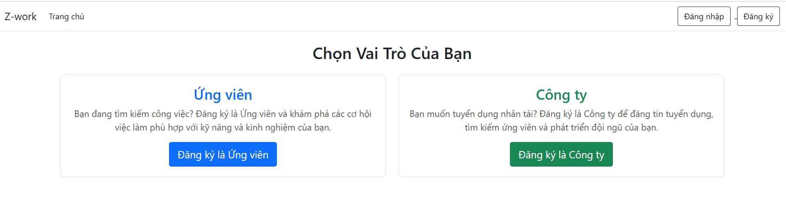
Đăng ký tài khoản công ty:
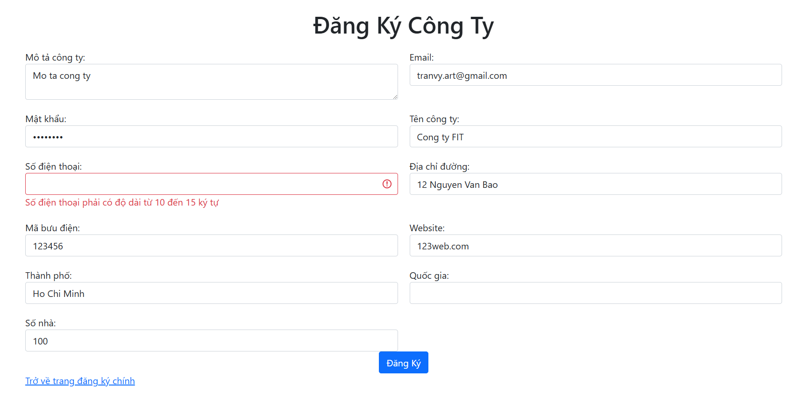
Đăng ký tài khoản ứng viên:
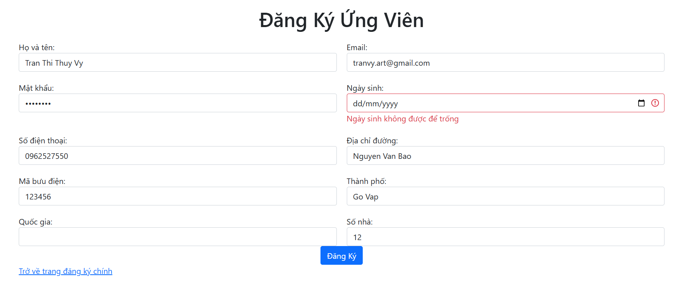
- Nếu nhập sai thông tin, thông báo lỗi sẽ hiển thị.
- Nếu đăng ký thành công, người dùng sẽ được chuyển hướng đến trang đăng nhập.

### Đăng nhập
Đăng nhập bằng email và mật khẩu.
- Nếu đăng nhập thành công, người dùng sẽ được chuyển hướng đến trang chính của mình.
- Nếu đăng nhập thất bại, thông báo lỗi sẽ hiển thị.
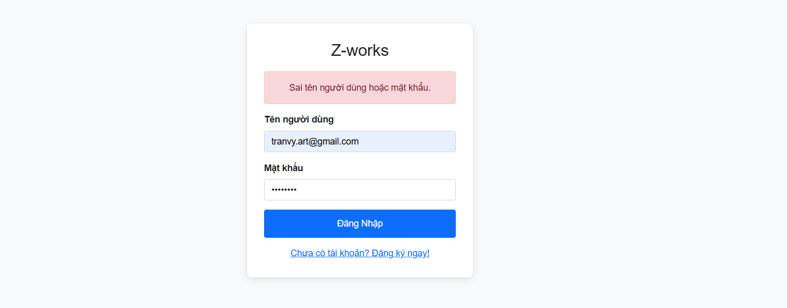
### Sử dụng spring security để phân quyền người dùng.
- Ứng viên:
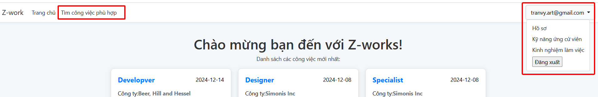
- Công ty:
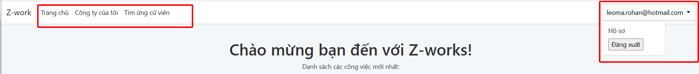

### Các chức năng của ứng viên
- Ứng viên có thể thêm các kỹ năng cho mình, tương ứng với các level khác nhau
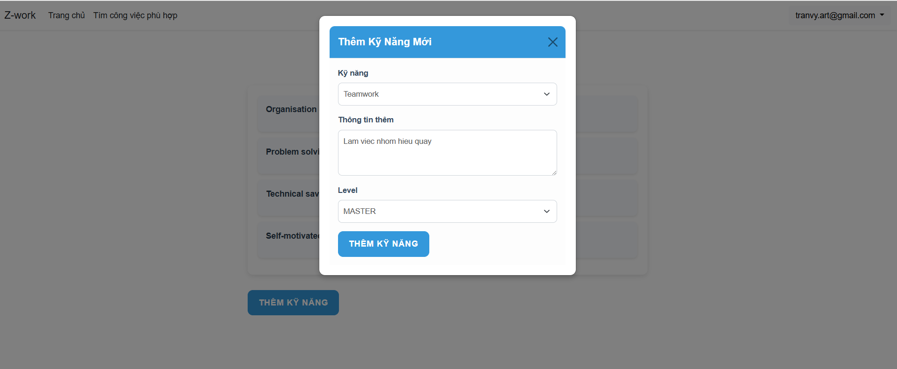
- Ứng viên có thể thêm kinh nghiệm làm việc cho mình:
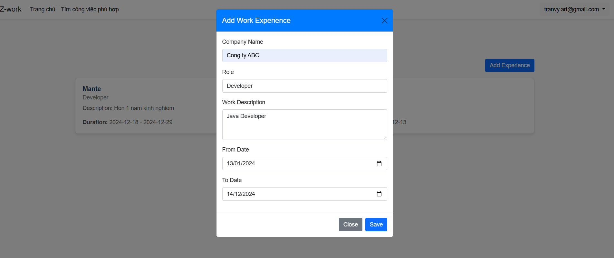
- Hồ sơ ứng viên sẽ hiển thị những thông tin của ứng viên:
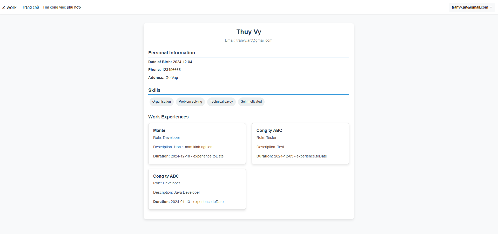
- Ứng viên có thể tìm kiếm công việc phù hợp với mình dựa vào skill:
- Danh mục sẽ gợi ý những công việc phù hợp với kỹ năng của ứng viên:
- Và những kỹ năng chưa phù hợp sẽ được gợi ý để ứng viên cải thiện:
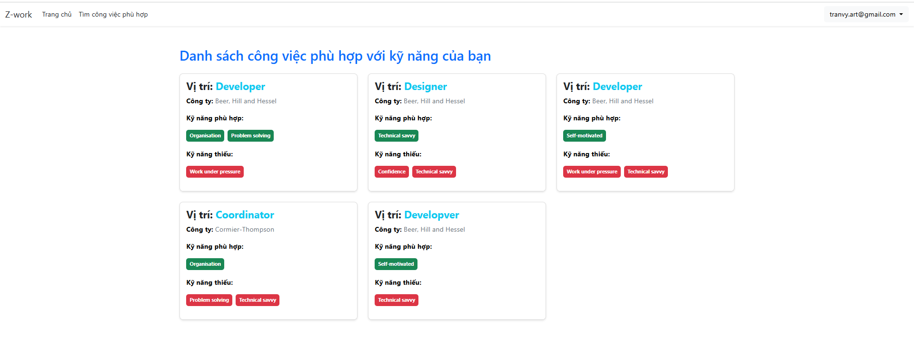

### Các chức năng của công ty
- Công ty có thể quản lý các công việc mà công ty đang tuyển dụng:
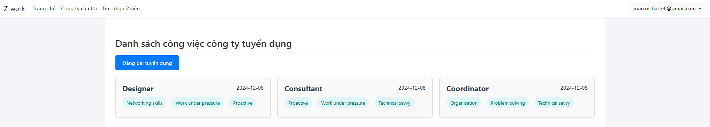
- Đăng bài tuyển dụng:
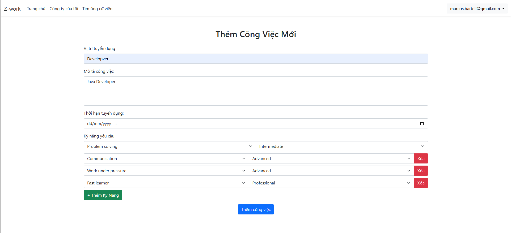
- Tìm ứng cử viên phù hợp dựa vào skill:
- Mỗi công việc sẽ hiển thị danh sách những ứng viên phù hợp với công việc:
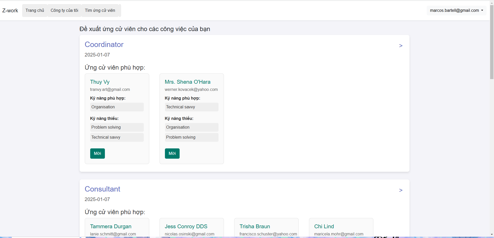
- Nhấn nút mời ứng viên để gửi email mời ứng viên:
- Mời ứng viên thành công:
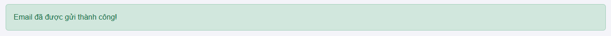
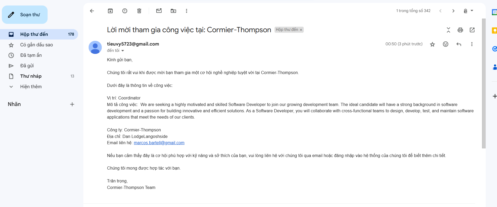

## Xin cảm ơn!


