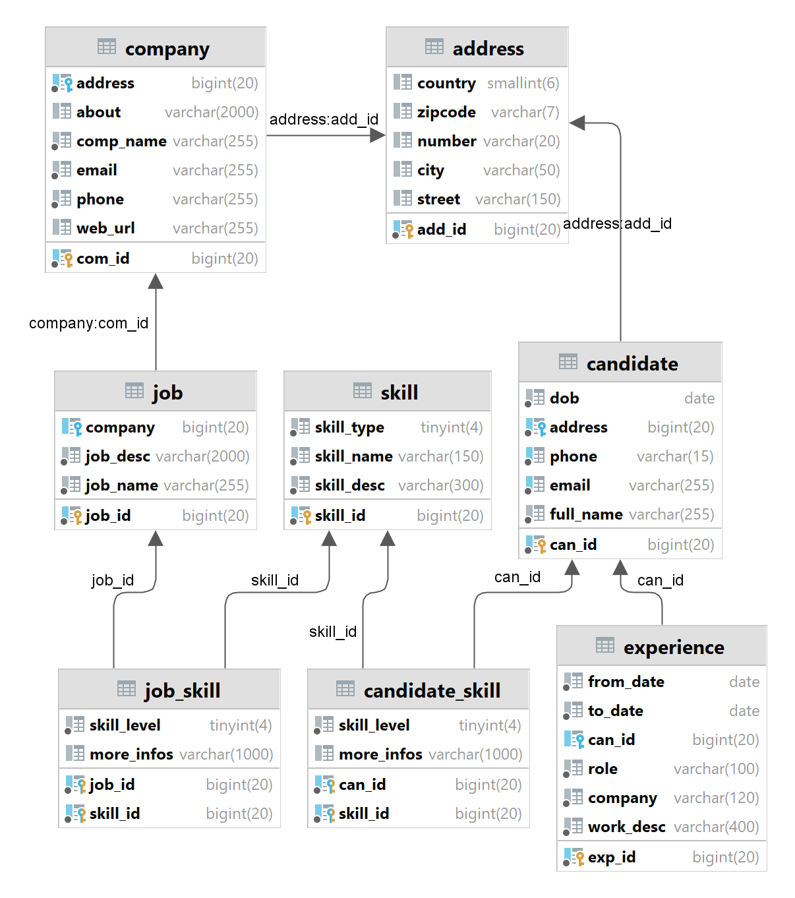

# Z-works
*(Đang trong quá trình phát triển)*
## Tổng quan 
Z-works là một nền tảng tuyển dụng công việc được xây dựng bằng Java và Spring Boot. Nó giúp các công ty đăng tin tuyển dụng và quản lý hiệu quả quy trình tuyển chọn ứng viên.

## Công nghệ sử dụng
- Java
- Spring Boot
- Gradle
- Thymeleaf
- Bootstrap
- MariaDB

## Cài đặt
- Clone repository về máy.
- Mở project bằng IDE.
- Cấu hình cơ sở dữ liệu trong `application.properties`.
- Chạy ứng dụng.

## Hướng dẫn sử dụng
- Truy cập ứng dụng tại địa chỉ `http://localhost:8080`.
- Sử dụng menu điều hướng để khám phá các phần khác nhau của ứng dụng.
- Chạy @Bean `initData` trong `ZworkApplication` để khởi tạo dữ liệu mẫu.
- Tương tác bằng giao diện thông qua menu điều hướng.
- Các địa chỉ:
- `/`: Đăng nhập
- `/companies`: Trang chủ - hiển thị danh sách công việc đang tuyển
- `/companies/getListJob`: Hiển thi danh sách công việc của công ty đã đăng nhập
- `/companies/createJob`: Tạo công việc mới

## Tính năng nổi bật
- Quản lý công ty
- Quản lý danh sách công việc
- Hỗ trợ phân trang cho danh sách công việc

## Cơ sở dữ liệu

